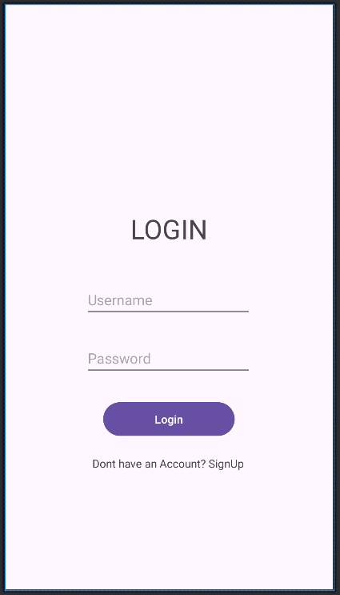

<h1 align="center">Login Sign Up Page in Android Studio</h1>

<p align="center">

</p>

## Description

This is a simple login and signup application built using **Java** and **XML**, with **SQLite** as the database. Users can create an account and log in securely.

## Features

- User Registration (Signup Page)
- User Authentication (Login Page)
- Data Storage with SQLite

## Screenshots

### Login Page


### Signup Page


### Home Page


## Technologies Used

- **Java** (Backend Logic)
- **XML** (UI Design)
- **SQLite** (Local Database)

## Installation

1. Clone the repository:
   ```sh
   git clone https://github.com/your-username/your-repo.git
   ```
2. Open the project in **Android Studio**.
3. Build and run the app on an emulator or a real device.

## Usage

1. Open the app.
2. Sign up by entering your details.
3. Log in with your registered credentials.
4. Access the main app interface.

## Contributing

Feel free to fork this repository and contribute! You can submit pull requests with improvements.

## Credits

- <a href="https://www.flaticon.com/free-icons/fingerprint-lock" title="fingerprint lock icons">Fingerprint lock icons created by sahila99 - Flaticon</a>
- <a href="https://www.pexels.com/photo/pink-and-white-background-7630061/" title="pink and white background">Pink and White Background by Eva Bronzini - Pexels.com</a>

## License

This project is licensed under the [MIT License](MIT-License)
